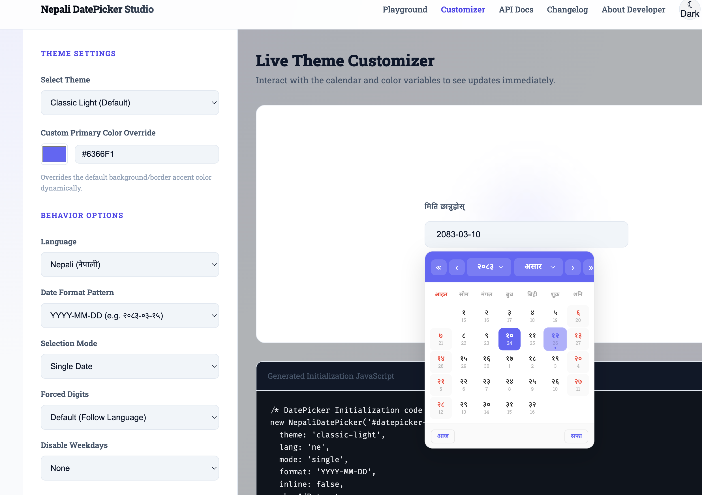
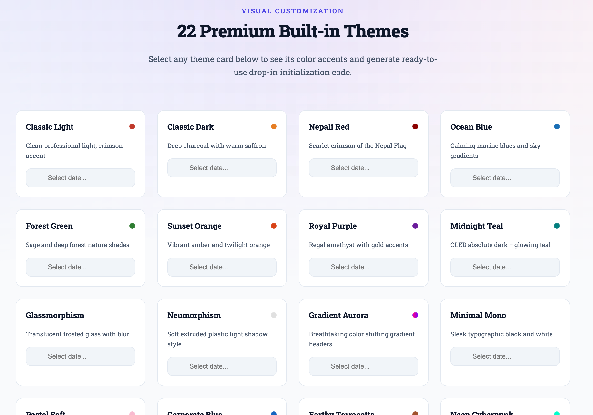
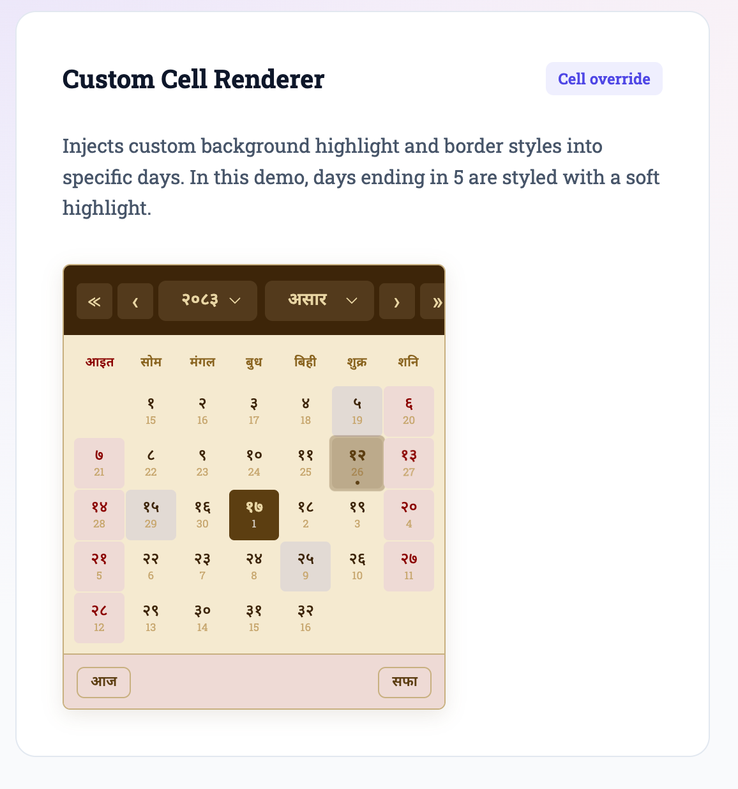
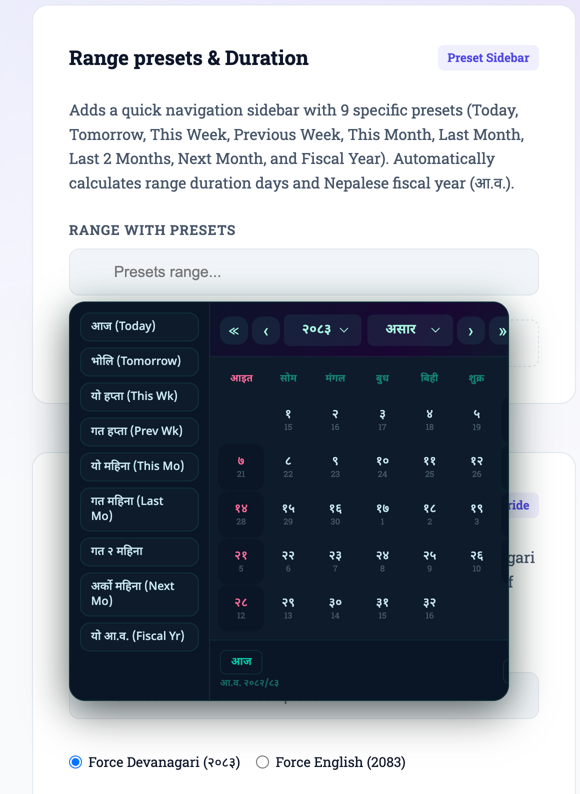
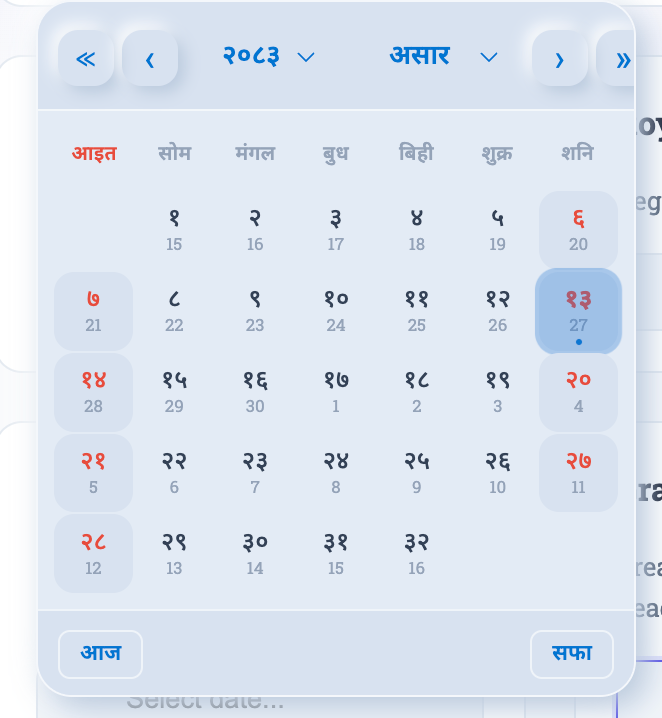
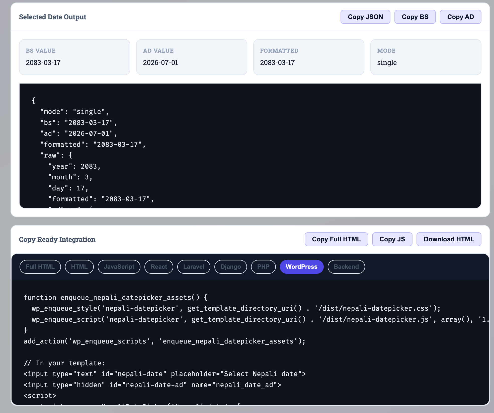

# Nepali DatePicker Studio

Modern, lightweight, open-source Nepali Bikram Sambat datepicker and BS/AD converter for the web.

Nepali DatePicker Studio turns ordinary HTML inputs into polished Nepali calendar widgets. It supports single dates, date ranges, multiple dates, date-time inputs, hotel check-in/check-out flows, BS to AD conversion, AD to BS conversion, export-ready backend values, custom themes, custom day rendering, and a live code generator for developers.

[Live Demo](https://kushalkhadkaa.github.io/nepali-datepicker-studio/) | [Theme Customizer](https://kushalkhadkaa.github.io/nepali-datepicker-studio/customizer.html) | [API Docs](https://kushalkhadkaa.github.io/nepali-datepicker-studio/docs.html) | [Changelog](https://kushalkhadkaa.github.io/nepali-datepicker-studio/changelog.html)

```html
<link rel="stylesheet" href="dist/nepali-datepicker.css">
<script src="dist/nepali-datepicker.js"></script>

<input id="nepali-date" type="text" placeholder="Select Nepali date">

<script>
  new NepaliDatePicker("#nepali-date", {
    lang: "ne",
    theme: "classic-light",
    format: "YYYY-MM-DD"
  });
</script>
```

## Introduction

Most Nepali web applications need to show dates in Bikram Sambat while databases, APIs, reports, analytics tools, and international integrations usually expect Gregorian AD dates. Nepali DatePicker Studio is built for that exact bridge.

It gives users a familiar Nepali calendar interface and gives developers structured data that can be used safely in forms, booking systems, dashboards, admin panels, hospital records, travel websites, event pages, and government or business workflows.

The project is intentionally simple to adopt:

- Load one CSS file.
- Load one JavaScript file.
- Add a normal input.
- Initialize `NepaliDatePicker`.
- Optionally sync the selected BS date to a hidden AD field for backend storage.

No jQuery, no framework lock-in, no runtime API request, no database call, and no build step are required for normal browser use.

## Screenshots

| Datepicker Widget | Live Theme Customizer |
|---|---|
|  |  |
| Bilingual popup datepicker with BS dates, AD hints, navigation, today, clear, and active date states. | Real-time theme and behavior customizer that generates ready-to-use integration code. |

| Theme Gallery | Custom Cell Renderer |
|---|---|
|  |  |
| 22 built-in visual themes for production interfaces, dashboards, booking forms, and brand-specific UI. | `renderDay` support for custom day styling, markers, holidays, disabled business days, or special events. |

| Range Presets | BS/AD Converter |
|---|---|
|  |  |
| Range picker presets for common reporting, fiscal, booking, and duration workflows. | Standalone converter widget for BS to AD, AD to BS, and date difference calculations. |

| Strict API Presets | Documentation Panel |
|---|---|
|  |  |
| Playground presets for strict API behavior, constraints, validation, and real-world configurations. | Developer documentation with options, methods, callbacks, helpers, and examples. |

## What It Does

Nepali DatePicker Studio provides a complete frontend toolkit for Nepali date workflows:

- Shows an interactive Bikram Sambat calendar.
- Converts BS dates to AD dates.
- Converts AD dates to BS dates.
- Formats dates in Nepali or English.
- Supports Devanagari and English digits.
- Handles single, range, and multiple date selection.
- Supports date-time inputs.
- Exports hidden AD values for backend forms.
- Provides themes and custom day rendering.
- Includes static demo pages, documentation, and a live code generator.

It is useful for:

- Nepali date inputs in public forms
- Hotel check-in and check-out systems
- Restaurant reservations
- Flight departure and return forms
- Hospital admission and discharge records
- School, college, and event registration forms
- Admin dashboards and reporting filters
- Date of birth fields
- Fiscal-year reporting
- BS/AD converter pages
- WordPress, Laravel, Django, PHP, and static HTML projects

## Features

### Calendar and Selection

- Single date picker
- Date range picker
- Multiple date selection
- Inline calendar mode
- Popup calendar mode
- Date and time picker support
- Today and clear actions
- Keyboard-friendly interaction
- Responsive layout for desktop and mobile

### Conversion and Formatting

- BS to AD conversion
- AD to BS conversion
- Static helper functions
- Date difference support through converter UI
- Custom output format support
- Nepali and English month/day labels
- Optional Devanagari digit rendering
- Calendar data range from 1970 BS to 2100 BS

### Validation and Constraints

- Minimum selectable date
- Maximum selectable date
- Disabled individual dates
- Disabled weekdays
- Future-only picker
- Past-only picker
- Booking-style dependent fields
- Range presets
- Strict API playground examples

### Developer Experience

- Pure vanilla JavaScript
- Pure CSS
- No jQuery
- No framework dependency
- No runtime API call
- No package install required for browser usage
- Works in static hosting, PHP, Laravel, Django, WordPress, and modern frontend apps
- Copy-ready code examples from the live customizer
- Hidden AD export field for reliable backend storage
- MIT licensed

### Design and Customization

- 22 built-in themes
- CSS-variable based visual system
- Live theme customizer
- Primary color override
- Custom day rendering with `renderDay`
- Holiday, weekend, and special-date styling
- Local fonts and static assets

## Lightweight by Design

The runtime integration surface is only:

```html
<link rel="stylesheet" href="dist/nepali-datepicker.css">
<script src="dist/nepali-datepicker.js"></script>
```

Everything needed by the datepicker is bundled locally:

- calendar data
- conversion utilities
- picker UI
- themes
- formatting helpers
- static helper APIs

That means the picker can run from:

- GitHub Pages
- shared hosting
- local HTML files
- PHP projects
- Laravel Blade templates
- Django templates
- WordPress themes
- admin panels
- static documentation sites

## How It Works

The library is organized into three practical layers.

| Layer | Purpose | What it gives developers |
|---|---|---|
| Calendar data | Stores BS month lengths, month names, weekday names, digit maps, and calendar metadata. | Reliable date facts without a server lookup. |
| Conversion utilities | Converts BS to AD and AD to BS using day offsets from a known reference date. | Structured BS/AD values for forms and APIs. |
| Datepicker UI | Renders the calendar, handles input binding, navigation, selection, formatting, themes, and callbacks. | A ready-to-use user interface. |

Runtime flow:

```text
HTML input
  -> new NepaliDatePicker(selector, options)
  -> options are normalized
  -> calendar state is prepared
  -> popup or inline calendar is rendered
  -> user selects a date
  -> validation rules run
  -> BS/AD conversion runs when needed
  -> visible input is updated
  -> hidden AD field is synchronized if configured
  -> callbacks receive structured data
```

## Quick Start

### 1. Add the files

```html
<link rel="stylesheet" href="dist/nepali-datepicker.css">
<script src="dist/nepali-datepicker.js"></script>
```

### 2. Add an input

```html
<input id="date" type="text" placeholder="Select Nepali date">
```

### 3. Initialize

```html
<script>
  new NepaliDatePicker("#date");
</script>
```

## Installation

### Static HTML

Copy the `dist/` folder into your project and include:

```html
<link rel="stylesheet" href="./dist/nepali-datepicker.css">
<script src="./dist/nepali-datepicker.js"></script>
```

### Laravel Blade

```blade
<link rel="stylesheet" href="{{ asset('dist/nepali-datepicker.css') }}">

<input id="booking_date_bs" name="booking_date_bs" type="text">
<input id="booking_date_ad" name="booking_date_ad" type="hidden">

<script src="{{ asset('dist/nepali-datepicker.js') }}"></script>
<script>
  new NepaliDatePicker("#booking_date_bs", {
    exportAdInput: "#booking_date_ad",
    showAdDate: true
  });
</script>
```

### Django Template

```html

<link rel="stylesheet" href="">

<input id="date_bs" name="date_bs" type="text">
<input id="date_ad" name="date_ad" type="hidden">

<script src=""></script>
<script>
  new NepaliDatePicker("#date_bs", {
    exportAdInput: "#date_ad"
  });
</script>
```

### WordPress Theme

```php
function ndp_enqueue_assets() {
    wp_enqueue_style(
        'nepali-datepicker',
        get_template_directory_uri() . '/dist/nepali-datepicker.css'
    );

    wp_enqueue_script(
        'nepali-datepicker',
        get_template_directory_uri() . '/dist/nepali-datepicker.js',
        array(),
        '1.2.0',
        true
    );
}
add_action('wp_enqueue_scripts', 'ndp_enqueue_assets');
```

## Quick Start for Production

For production forms, the recommended pattern is:

- Show BS date to the user.
- Store AD date in the backend.
- Keep both values available if your domain needs both.

```html
<label for="booking-date-bs">Booking date</label>
<input id="booking-date-bs" name="booking_date_bs" type="text" placeholder="Select BS date">
<input id="booking-date-ad" name="booking_date_ad" type="hidden">

<script>
  new NepaliDatePicker("#booking-date-bs", {
    lang: "ne",
    format: "YYYY-MM-DD",
    showAdDate: true,
    exportAdInput: "#booking-date-ad",
    onChange(date) {
      console.log("BS:", date.formatted);
      console.log("AD:", date.adDate);
    }
  });
</script>
```

This gives Nepali users a local calendar experience while your application receives a database-friendly Gregorian date.

## Developer Widget Code Generator

The live customizer includes a developer-focused code generator for turning configuration choices into copy-ready snippets.

[Open the Customizer](https://kushalkhadkaa.github.io/nepali-datepicker-studio/customizer.html)

It helps junior developers by showing complete working code, and it helps senior developers by exposing the exact configuration, callback flow, backend export pattern, and framework integration shape.

The generator can produce:

- Full working HTML example
- HTML-only markup
- JavaScript initialization
- React-style snippet
- Laravel Blade snippet
- Django template snippet
- PHP form snippet
- WordPress enqueue/template snippet
- Backend storage recommendation
- Downloadable working HTML file

Available use-case presets:

- Basic Nepali date input
- Date range picker
- Hotel check-in / check-out
- Restaurant reservation
- Flight departure / return
- Hospital admission / discharge
- Event start / end
- Date of birth / past-only picker
- Future-only booking date
- Inline dashboard calendar
- BS/AD converter widget

## Usage Examples

### Single Date

```javascript
new NepaliDatePicker("#date", {
  mode: "single",
  theme: "classic-light",
  lang: "ne",
  onChange(date) {
    console.log(date.formatted);
    console.log(date.adDate);
  }
});
```

### Date Range

```javascript
new NepaliDatePicker("#range", {
  mode: "range",
  presets: true,
  showAdDate: true,
  onRangeChange(range) {
    console.log(range.start);
    console.log(range.end);
  }
});
```

### Multiple Dates

```javascript
new NepaliDatePicker("#multiple", {
  mode: "multiple",
  lang: "en",
  showAdDate: true
});
```

### Inline Dashboard Calendar

```javascript
new NepaliDatePicker("#calendar", {
  inline: true,
  theme: "corporate-blue",
  lang: "en"
});
```

### Date and Time

```javascript
new NepaliDatePicker("#date-time", {
  enableTime: true,
  format: "YYYY-MM-DD"
});
```

### Hidden AD Export

```html
<input id="bs-date" name="bs_date" type="text">
<input id="ad-date" name="ad_date" type="hidden">

<script>
  new NepaliDatePicker("#bs-date", {
    showAdDate: true,
    exportAdInput: "#ad-date"
  });
</script>
```

### Hotel Check-in and Check-out

```html
<input id="check-in" type="text" placeholder="Check in">
<input id="check-out" type="text" placeholder="Check out">
```

```javascript
const checkOut = new NepaliDatePicker("#check-out", {
  enableTime: true,
  lang: "en",
  dateFormat: "Day Month Year Time 12 hour"
});

const checkIn = new NepaliDatePicker("#check-in", {
  enableTime: true,
  lang: "en",
  dateFormat: "Day Month Year Time 12 hour",
  onChange(date) {
    checkOut.setMinDate({
      year: date.year,
      month: date.month,
      day: date.day
    });
  }
});
```

### Date of Birth / Past Only

```javascript
new NepaliDatePicker("#dob", {
  pastOnly: true,
  maxDate: NepaliDatePicker.today(),
  lang: "ne"
});
```

### Future Booking Date

```javascript
new NepaliDatePicker("#appointment-date", {
  futureOnly: true,
  showAdDate: true,
  exportAdInput: "#appointment-date-ad"
});
```

### Custom Day Rendering

```javascript
new NepaliDatePicker("#calendar", {
  inline: true,
  renderDay(day, cell) {
    if (day.day % 10 === 5) {
      cell.style.borderColor = "#6366f1";
      cell.title = "Custom marker";
    }
  }
});
```

## Core Options

| Option | Type | Default | Description |
|---|---:|---:|---|
| `theme` | string | `classic-light` | Visual theme name. |
| `lang` | string | `ne` | UI/output language: `ne` or `en`. |
| `mode` | string | `single` | Selection mode: `single`, `range`, or `multiple`. |
| `format` | string | `YYYY-MM-DD` | Output format. |
| `inline` | boolean | `false` | Render inline instead of as a popup. |
| `showAdDate` | boolean | `true` | Show AD date hints inside day cells. |
| `showTodayBtn` | boolean | `true` | Show the today button. |
| `showClearBtn` | boolean | `true` | Show the clear button. |
| `minDate` | object | `null` | Minimum selectable BS date. |
| `maxDate` | object | `null` | Maximum selectable BS date. |
| `disabledDates` | array | `[]` | Specific disabled BS dates. |
| `disabledDaysOfWeek` | array | `[]` | Disable weekdays by index. |
| `enableTime` | boolean | `false` | Enable time controls. |
| `presets` | boolean | `false` | Enable range preset shortcuts. |
| `unicodeDates` | boolean/null | `null` | Force Nepali or English digits. |
| `futureOnly` | boolean | `false` | Disable past dates. |
| `pastOnly` | boolean | `false` | Disable future dates. |
| `exportAdInput` | string/null | `null` | Selector for hidden synchronized AD input. |
| `renderDay` | function/null | `null` | Customize individual day cells. |

## Public Methods

```javascript
const picker = new NepaliDatePicker("#date");

picker.getDate();
picker.setDate({ year: 2083, month: 3, day: 12 });
picker.getDates();
picker.getRange();
picker.clear();
picker.open();
picker.close();
picker.toggle();
picker.setMinDate({ year: 2083, month: 3, day: 1 });
picker.setTheme("neon-cyberpunk");
picker.setLang("en");
picker.jumpTo(2083, 6);
picker.destroy();
```

## Static Helpers

```javascript
NepaliDatePicker.today();
NepaliDatePicker.bsToAd(2083, 3, 12);
NepaliDatePicker.adToBs(new Date());
NepaliDatePicker.version;

AD2BS("2026-06-26");
BS2AD("2083-03-12");
```

## Built-in Themes

```text
classic-light, classic-dark, nepali-red, ocean-blue, forest-green,
sunset-orange, royal-purple, midnight, glassmorphism, neumorphism,
gradient-aurora, minimal-mono, pastel-soft, corporate-blue,
earthy-terracotta, neon-cyberpunk, material-design, retro-paper,
high-contrast, festive-dashain, mountain-mist, tropical-teal
```

Theme ideas:

| Use case | Suggested themes |
|---|---|
| Business dashboard | `classic-light`, `corporate-blue`, `minimal-mono` |
| Booking/reservation UI | `ocean-blue`, `forest-green`, `pastel-soft` |
| Dark admin panel | `classic-dark`, `midnight`, `high-contrast` |
| Festival or cultural UI | `nepali-red`, `festive-dashain`, `retro-paper` |
| Experimental interfaces | `glassmorphism`, `gradient-aurora`, `neon-cyberpunk` |

## System Architecture

Nepali DatePicker Studio is designed as a static, dependency-free frontend library. The public release can be hosted from any static file server, and production users only need the files inside `dist/`.

```text
HTML page
  |
  |-- dist/nepali-datepicker.css
  |     |
  |     |-- base calendar layout
  |     |-- responsive styles
  |     |-- state classes
  |     |-- 22 theme definitions
  |
  |-- dist/nepali-datepicker.js
        |
        |-- Calendar data layer
        |     |-- BS month length table
        |     |-- month names and weekday names
        |     |-- digit maps and metadata
        |
        |-- Utility/conversion layer
        |     |-- BS validation
        |     |-- AD validation
        |     |-- BS to AD conversion
        |     |-- AD to BS conversion
        |     |-- formatting and digit conversion
        |
        |-- Datepicker UI layer
        |     |-- input binding
        |     |-- popup and inline rendering
        |     |-- month/year navigation
        |     |-- single/range/multiple selection
        |     |-- time picker and presets
        |     |-- callbacks and hidden AD export
        |
        |-- Converter widget layer
              |-- standalone BS/AD converter UI
              |-- date difference utilities
```

### Runtime Flow

```text
Developer adds an input
        |
        v
new NepaliDatePicker("#input", options)
        |
        v
Options are normalized and internal state is prepared
        |
        v
User opens the picker
        |
        v
Calendar DOM is generated for the active BS month
        |
        v
User selects date, range, multiple dates, or time
        |
        v
Rules are checked: min, max, disabled, futureOnly, pastOnly
        |
        v
BS/AD conversion and formatting are applied
        |
        v
Visible input, hidden AD field, and callbacks are updated
```

### Public Release Structure

```text
.
|-- index.html
|-- customizer.html
|-- docs.html
|-- about.html
|-- changelog.html
|-- dist/
|   |-- nepali-datepicker.css
|   `-- nepali-datepicker.js
|-- assets/
|   |-- css/
|   |-- js/
|   |-- fonts/
|   `-- screenshots/
|-- scripts/
|   `-- validate-release.js
|-- llms.txt
|-- robots.txt
|-- sitemap.xml
|-- README.md
|-- package.json
`-- LICENSE
```

### Why This Architecture

- Static files are easy to deploy anywhere.
- The datepicker works without a backend.
- BS/AD conversion is local and offline-ready.
- CSS themes are separated from JavaScript date logic.
- Demo pages are separate from the reusable library bundle.
- The customizer generates production code without changing the core library.

## Conversion Algorithm

The BS/AD conversion is lookup-table based, not a rough formula.

Bikram Sambat month lengths vary by year. Because of that, a simple year difference or Gregorian-style leap-year formula is not accurate enough. Nepali DatePicker Studio uses stored BS month-length data and a known reference date.

### Reference Point

```text
1970-01-01 BS = 1913-04-13 AD
```

### BS to AD

1. Validate the BS year, month, and day.
2. Count the number of days from `1970-01-01 BS` to the requested BS date.
3. Add that day offset to `1913-04-13 AD`.
4. Return the matching AD year, month, and day.

Conceptually:

```text
AD date = base AD date + days elapsed from base BS date
```

### AD to BS

1. Validate the AD date.
2. Count the number of days between the requested AD date and `1913-04-13 AD`.
3. Walk through the BS calendar table year by year and month by month.
4. Stop when the remaining day count falls inside a BS month.
5. Return the matching BS year, month, and day.

Conceptually:

```text
days elapsed = AD date - base AD date
BS date = position inside BS calendar table at elapsed day count
```

This is deterministic, offline-friendly, and safer than guessing. If a date is outside the supported calendar range, the library rejects it instead of silently returning an unreliable result.

## DatePicker Algorithm

The datepicker UI follows a predictable lifecycle.

1. Bind target  
   The constructor receives an input, container, DOM element, or selector.

2. Normalize options  
   Defaults are merged with user options. Compatibility aliases such as `dateFormat`, `range`, `multiple`, and `language` are mapped into the current API shape.

3. Initialize state  
   The picker stores current BS year/month, selected date, range state, multiple selections, time values, language, theme, and constraints.

4. Build calendar DOM  
   On open or inline render, it creates the calendar shell, header, year/month controls, weekday row, day grid, footer actions, presets, and optional time controls.

5. Render month grid  
   For each visible cell, the picker calculates:

   - BS day number
   - matching AD date
   - weekday
   - disabled state
   - weekend/holiday state
   - selected state
   - range state
   - multiple-selected state
   - custom `renderDay` modifications

6. Handle interaction  
   Clicks, keyboard movement, previous/next navigation, month/year dropdowns, today, clear, presets, and time controls update internal state.

7. Format output  
   The selected value is formatted using `format`, `lang`, and `unicodeDates`.

8. Emit callbacks  
   Hooks such as `onChange`, `onRangeChange`, `onOpen`, `onClose`, `onToday`, and `onClear` receive structured date information.

9. Sync backend field  
   When `exportAdInput` is configured, the converted AD value is written to the matching hidden field.

## Data Returned to Developers

A selected date can include:

```javascript
{
  year: 2083,
  month: 3,
  day: 12,
  formatted: "2083-03-12",
  adDate: "2026-06-26"
}
```

Range pickers return start/end data. Multiple pickers return an array of selected dates. The exact shape depends on selection mode, but the goal is always the same: user-friendly BS display plus developer-friendly structured data.

## Backend Storage Recommendation

Recommended database pattern:

| Field | Purpose | Example |
|---|---|---|
| `booking_date_bs` | Human-facing Nepali date | `2083-03-12` |
| `booking_date_ad` | Query/sort/report-friendly Gregorian date | `2026-06-26` |
| `timezone` | Optional context for date-time flows | `Asia/Kathmandu` |

For most systems, store AD as the primary sortable value and keep BS as a display/reference value when the business domain needs it.

## Browser Support

Designed for modern browsers:

- Chrome
- Firefox
- Safari
- Edge
- Opera
- Mobile Safari
- Chrome for Android

## Quality Checks

The repository includes a zero-dependency validation script:

```bash
npm test
```

It checks:

- required public files
- JavaScript syntax
- non-empty CSS files
- SEO basics for HTML pages
- sitemap and robots references
- README screenshot links
- MIT license signal
- package entrypoints

## Project Status

Nepali DatePicker Studio is public and open source under the MIT License. The project is suitable for production evaluation, static demos, learning, and integration into real applications that need a Nepali calendar experience.

## FAQ

### Is this open source?

Yes. Nepali DatePicker Studio is released under the MIT License.

### Does it need jQuery?

No. It is pure vanilla JavaScript and CSS.

### Does it need npm or a build system?

No. For normal browser usage, copy `dist/nepali-datepicker.css` and `dist/nepali-datepicker.js` into your project and include them with HTML tags.

### Does it work offline?

Yes. Calendar data, conversion logic, styles, fonts, and widgets are local files. No remote API call is required for date conversion.

### How accurate is the BS/AD conversion?

The conversion uses static BS month-length data and day-offset calculation from a known reference date. It is not a rough year-difference formula.

### What date range is supported?

The included calendar data covers 1970 BS to 2100 BS.

### Can I store AD dates in my database?

Yes. Use `exportAdInput` to synchronize the selected BS date into a hidden AD input field.

### Can I keep both BS and AD dates?

Yes. Many production systems store AD for sorting/querying and BS for user-facing display or audit context.

### Can I customize the design?

Yes. The library includes 22 themes and a live customizer. Themes are CSS-variable based, so colors can be customized without editing the core JavaScript.

### Can I use it for hotel check-in and check-out?

Yes. The picker supports date ranges, time selection, minimum date updates, and booking-specific date-time formats.

### Can I disable past or future dates?

Yes. Use `futureOnly`, `pastOnly`, `minDate`, `maxDate`, `disabledDates`, or `disabledDaysOfWeek`.

### Can I highlight special dates?

Yes. Use the `renderDay(day, cell)` hook to add classes, styles, labels, or tooltips to specific calendar cells.

### Is this only for Nepali language?

No. It supports Nepali and English UI/output, including optional Devanagari digit rendering.

### Can I use it with React, Vue, or other frameworks?

Yes. The library is framework-independent. Use it after the input element is mounted, and destroy/reinitialize it when your component lifecycle requires cleanup.

### Can I use only the converter functions?

Yes. Static helpers such as `NepaliDatePicker.bsToAd()` and `NepaliDatePicker.adToBs()` can be used without showing the picker UI.

## License

Released under the MIT License.

Copyright (c) 2026 Kushal Khadka.
