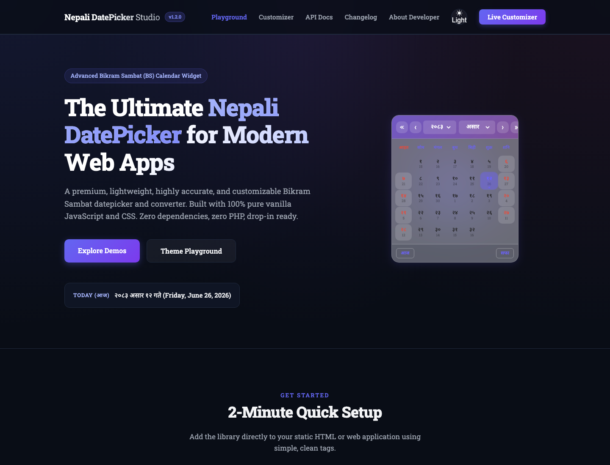
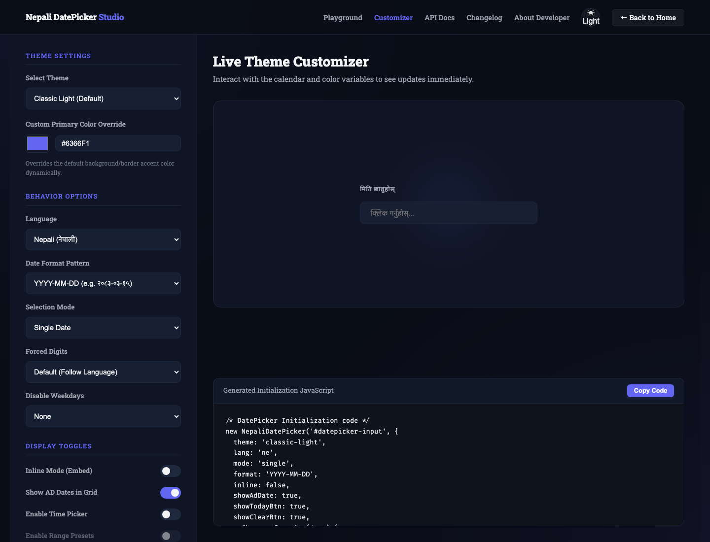

# Nepali DatePicker Studio

Open-source Nepali Bikram Sambat datepicker and BS/AD converter built with pure vanilla JavaScript and CSS.

Nepali DatePicker Studio turns ordinary HTML inputs into interactive Nepali calendar widgets. It supports single-date selection, date ranges, multiple dates, time selection, BS to AD conversion, AD to BS conversion, themes, presets, validation, and export-friendly values for real forms.

[Live demo](https://kushalkhadkaa.github.io/nepali-datepicker-studio/) · [API docs](https://kushalkhadkaa.github.io/nepali-datepicker-studio/docs.html) · [Customizer](https://kushalkhadkaa.github.io/nepali-datepicker-studio/customizer.html)

## Screenshots

### Playground



### Live Theme Customizer



### API Documentation


## What It Does

Nepali DatePicker Studio provides a browser-ready calendar UI for the Nepali Bikram Sambat calendar. It lets users select BS dates while giving developers structured date objects, formatted strings, and synchronized AD values for backend systems.

The library is useful for:

- Nepali date fields in forms
- hotel check-in and checkout flows
- booking and reservation systems
- hospital admission and discharge dates
- flight departure and return dates
- event start and end dates
- BS to AD converter tools
- Nepali calendar dashboards
- bilingual Nepali/English interfaces

## Features

- Pure vanilla JavaScript and CSS
- No jQuery, no framework, no build step required
- BS to AD and AD to BS conversion
- Calendar data range from 1970 BS to 2100 BS
- Single, range, and multiple selection modes
- Inline calendar or popup calendar
- Time picker support
- Range presets
- Hidden AD field export
- Nepali and English output
- Devanagari digit support
- Custom date formats
- Minimum and maximum date limits
- Disabled dates and disabled weekdays
- Future-only and past-only selection
- Custom day rendering with `renderDay`
- Holiday, weekend, fiscal year, and Tithi UI support
- Mobile-friendly picker layout
- Keyboard navigation
- 22 built-in themes
- Live customizer for theme and option generation
- Offline-ready local fonts and assets
- MIT licensed

## How It Works

The library has three main layers:

1. Calendar data
   Static month-length data defines how many days each BS month contains between 1970 BS and 2100 BS.

2. Conversion utilities
   Utility functions convert dates between BS and AD by counting days from a known reference date.

3. Datepicker UI
   The UI layer binds to an input or container, renders the current BS month, handles navigation and selection, then writes formatted output back to the page.

The browser only needs:

```html
<link rel="stylesheet" href="dist/nepali-datepicker.css">
<script src="dist/nepali-datepicker.js"></script>
```

## Conversion Algorithm

The BS/AD conversion is lookup-table based, not an approximate formula.

Bikram Sambat month lengths vary by year. Because of that, a simple Gregorian-style leap-year formula is not enough for accurate BS conversion. This library uses verified static BS calendar metadata and a reference epoch.

### Reference Point

The conversion engine uses a known base mapping:

```text
1970-01-01 BS = 1913-04-13 AD
```

### BS to AD

For BS to AD conversion:

1. Validate the BS year, month, and day.
2. Count all days from `1970-01-01 BS` to the selected BS date.
3. Add that day offset to `1913-04-13 AD`.
4. Return the matching Gregorian date object and date parts.

Conceptually:

```text
AD date = base AD date + days elapsed from base BS date
```

### AD to BS

For AD to BS conversion:

1. Validate the AD date.
2. Count days between the selected AD date and `1913-04-13 AD`.
3. Walk forward through the BS calendar data year by year and month by month.
4. Stop when the remaining day count falls inside the current BS month.
5. Return the matching BS year, month, and day.

Conceptually:

```text
days elapsed = AD date - base AD date
BS date = calendar table position at elapsed day count
```

This approach favors correctness over guessing. If a requested date falls outside the supported calendar range, the utility throws or rejects it rather than silently returning a wrong date.

## DatePicker Algorithm

The datepicker UI works through a predictable lifecycle:

1. Bind target
   The constructor receives an input, container, or CSS selector.

2. Normalize options
   Options are merged with defaults. Compatibility aliases such as `dateFormat`, `range`, `multiple`, and `language` are mapped to the current API.

3. Initialize state
   The picker stores current BS year/month, selected date, range state, multiple selections, time values, and language/theme settings.

4. Build calendar DOM
   On open or inline render, the picker creates the calendar shell, header, weekday row, day grid, footer buttons, presets, and optional time controls.

5. Render month grid
   It calculates:
   - first weekday of the BS month
   - number of days in the BS month
   - matching AD date for every BS day
   - disabled state
   - weekend/holiday state
   - selected/range/multiple state
   - custom `renderDay` output

6. Handle user interaction
   Clicks, keyboard events, month navigation, year navigation, presets, time selectors, clear, and today buttons update internal state.

7. Format output
   The selected date is formatted using the configured `format`, `lang`, and `unicodeDates` options.

8. Emit callbacks
   Hooks such as `onChange`, `onRangeChange`, `onOpen`, `onClose`, `onToday`, and `onClear` run after state updates.

9. Sync AD export
   If `exportAdInput` is configured, the picker writes the converted AD value into another form field.

## Installation

Download or copy the `dist/` folder into your project.

```html
<link rel="stylesheet" href="dist/nepali-datepicker.css">
<script src="dist/nepali-datepicker.js"></script>
```

Add an input:

```html
<input type="text" id="nepali-date" placeholder="Select Nepali date">
```

Initialize:

```html
<script>
  new NepaliDatePicker('#nepali-date', {
    theme: 'classic-light',
    lang: 'ne',
    format: 'YYYY-MM-DD'
  });
</script>
```

## Usage Examples

### Single Date

```javascript
new NepaliDatePicker('#date', {
  mode: 'single',
  theme: 'classic-light',
  lang: 'ne',
  onChange(date) {
    console.log(date.formatted, date.adDate);
  }
});
```

### Date Range

```javascript
new NepaliDatePicker('#range', {
  mode: 'range',
  presets: true,
  showAdDate: true,
  onRangeChange(range) {
    console.log(range.start, range.end);
  }
});
```

### Multiple Dates

```javascript
new NepaliDatePicker('#multiple', {
  mode: 'multiple',
  lang: 'en'
});
```

### Date and Time

```javascript
new NepaliDatePicker('#date-time', {
  enableTime: true,
  format: 'YYYY-MM-DD'
});
```

### Hidden AD Export

```html
<input type="text" id="bs-date">
<input type="hidden" id="ad-date" name="ad_date">

<script>
  new NepaliDatePicker('#bs-date', {
    exportAdInput: '#ad-date'
  });
</script>
```

### Hotel Check-in and Checkout

```javascript
const checkIn = new NepaliDatePicker('#check-in', {
  enableTime: true,
  lang: 'en',
  dateFormat: 'Day Month Year Time 12 hour',
  onChange(date) {
    checkOut.setMinDate({
      year: date.year,
      month: date.month,
      day: date.day
    });
  }
});

const checkOut = new NepaliDatePicker('#check-out', {
  enableTime: true,
  lang: 'en',
  dateFormat: 'Day Month Year Time 12 hour'
});
```

### Custom Day Rendering

```javascript
new NepaliDatePicker('#calendar', {
  inline: true,
  renderDay(day, cell) {
    if (day.day % 10 === 5) {
      cell.style.borderColor = '#6366f1';
      cell.title = 'Custom marker';
    }
  }
});
```

## Core Options

| Option | Type | Default | Description |
|---|---:|---:|---|
| `theme` | string | `classic-light` | Visual theme name |
| `lang` | string | `ne` | `ne` or `en` |
| `mode` | string | `single` | `single`, `range`, or `multiple` |
| `format` | string | `YYYY-MM-DD` | Output format |
| `inline` | boolean | `false` | Render inline instead of popup |
| `showAdDate` | boolean | `true` | Show AD day label in cells |
| `showTodayBtn` | boolean | `true` | Show today button |
| `showClearBtn` | boolean | `true` | Show clear button |
| `minDate` | object | `null` | Minimum selectable BS date |
| `maxDate` | object | `null` | Maximum selectable BS date |
| `disabledDates` | array | `[]` | Specific disabled BS dates |
| `disabledDaysOfWeek` | array | `[]` | Disable weekdays by index |
| `enableTime` | boolean | `false` | Enable time controls |
| `presets` | boolean | `false` | Enable range presets |
| `unicodeDates` | boolean/null | `null` | Force Nepali or English digits |
| `futureOnly` | boolean | `false` | Disable past dates |
| `pastOnly` | boolean | `false` | Disable future dates |
| `exportAdInput` | string/null | `null` | Selector for synced AD output |
| `renderDay` | function/null | `null` | Customize individual cells |

## Public Methods

```javascript
const picker = new NepaliDatePicker('#date');

picker.getDate();
picker.setDate({ year: 2083, month: 3, day: 12 });
picker.getDates();
picker.getRange();
picker.clear();
picker.open();
picker.close();
picker.toggle();
picker.setMinDate({ year: 2083, month: 3, day: 1 });
picker.setTheme('neon-cyberpunk');
picker.setLang('en');
picker.jumpTo(2083, 6);
picker.destroy();
```

## Static Helpers

```javascript
NepaliDatePicker.today();
NepaliDatePicker.bsToAd(2083, 3, 12);
NepaliDatePicker.adToBs(new Date());
NepaliDatePicker.version;

AD2BS('2026-06-26');
BS2AD('2083-03-12');
```

## Built-in Themes

```text
classic-light, classic-dark, nepali-red, ocean-blue, forest-green,
sunset-orange, royal-purple, midnight, glassmorphism, neumorphism,
gradient-aurora, minimal-mono, pastel-soft, corporate-blue,
earthy-terracotta, neon-cyberpunk, material-design, retro-paper,
high-contrast, festive-dashain, mountain-mist, tropical-teal
```

## Project Structure

```text
.
├── index.html
├── customizer.html
├── docs.html
├── about.html
├── changelog.html
├── dist/
│   ├── nepali-datepicker.css
│   └── nepali-datepicker.js
├── assets/
│   ├── css/
│   ├── js/
│   ├── fonts/
│   └── screenshots/
├── llms.txt
├── robots.txt
├── sitemap.xml
└── LICENSE
```

## Browser Support

Nepali DatePicker Studio is designed for modern browsers:

- Chrome
- Firefox
- Safari
- Edge
- Opera

## AI and Search Friendliness

The project includes:

- semantic HTML pages
- canonical URLs
- Open Graph metadata
- Twitter card metadata
- JSON-LD software metadata
- `robots.txt`
- `sitemap.xml`
- `llms.txt` for AI assistant retrieval

## License

Released under the MIT License.

Copyright (c) 2026 Kushal Khadka.
